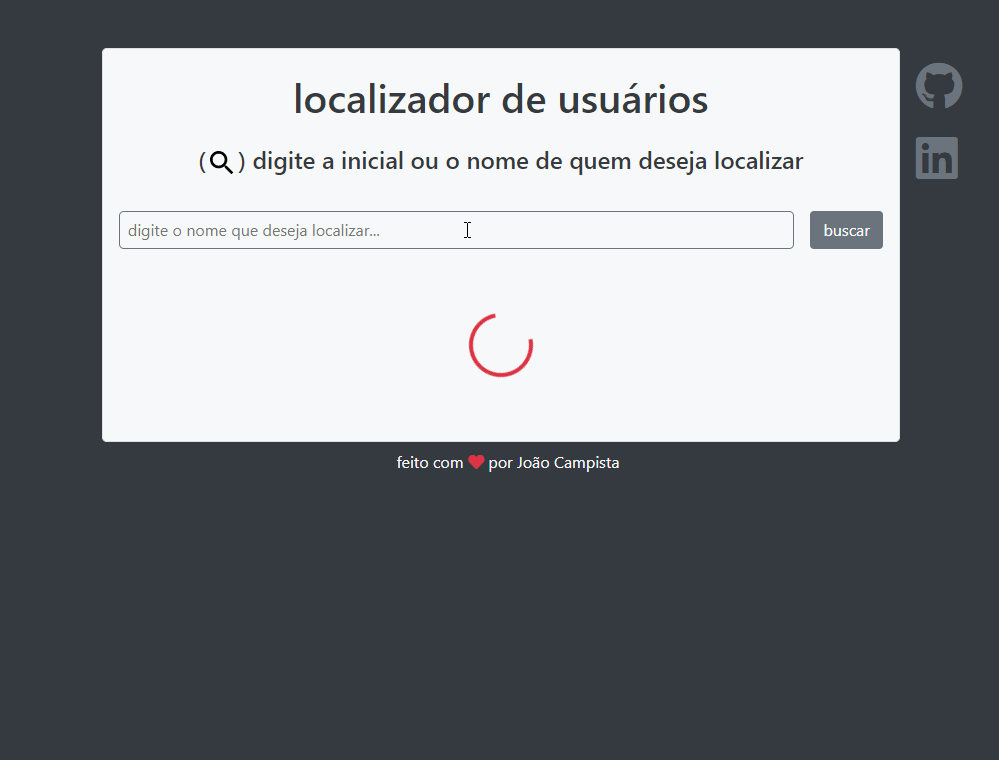

  

<h1 align="center">Bootcamp de Desenvolvedor Full-Stack</h1>

## :dart: Objetivos

Conhecer técnicas de construção de uma aplicação passando por todas as suas camadas lógicas - backend, frontend,
persistência de dados NoSQL, controle de versionamentode código com Git e implantação em nuvem - habilitando-se
para atuar profissionalmente na área.

## :book: Módulos

<ol>
<li>
<h3><b>Fundamentos</b></h3>

Introdução, instalação e configuração do Visual Studio
Code (<b>VSCode</b>). Instalação do <b>Node.js</b>. Instalação
da biblioteca <b>live-server</b>. Noções de <b>HTML</b> e <b>CSS</b>.
Introdução ao <b>JavaScript</b>. Integração do <b>JavaScript</b>
com o <b>HTML</b> e <b>CSS</b>. <b>JavaScript</b> básico – console,
comentários, tipos primitivos, variáveis, API’s nativas
de servidor e web, funções, estruturas de decisão,
estruturas de repetição, manipulação de eventos.

</li>
<li>
<h3><b>Desenvolvimento de API’s</b></h3>

Introdução ao desenvolvimento backend. Backend
x frontend. Introdução ao desenvolvimento de
APIs. Introdução ao desenvolvimento com <b>Node.
js</b>. Introdução ao <b>Express</b>. Criação de requisições
<b>HTTP</b>, <b>rotas</b> e <b>middlewares</b> com <b>Express</b>. Introdução
à ferramenta <b>Insomnia</b>. Construção de <b>APIs HTTP</b>,
utilizando as principais operações: <b>GET</b>, <b>POST</b>, <b>PUT</b>,
e <b>DELETE</b>. Desenvolvimento das operações <b>CRUD</b>.
<b>Persistência de Dados</b> em Arquivos.

</li>
<li>
<h3><b>FrontEnd com React</b></h3>

Instalação e configuração do <b><b>React</b></b>. Criação de projetos
com o <b>create-react-app</b>. Introdução ao <b>React – JSX</b>,
Componentes de <b>Funções</b>, <b>Componentes de Classe</b>,
<b>State</b>, <b>Props</b>, <b>Binding</b>, <b>Interpolação</b>. Comunicação entre
componentes. Ciclo de vida de componentes de classe.
Introdução às requisições <b>HTTP</b> com <b>React</b>. Roteamento
com <b>React-router</b>. Introdução ao <b>Ionic React</b>. Criação de
um pequeno projeto passo-a-passo com <b>React</b>.

</li>
<li>
<h3><b>Persistência de dados, versionamento de código e implantação</b></h3>

Introdução ao <b>MongoDB</b>. Utilização do serviço <b>mLab</b>.
Integrando a API ao <b>MongoDB</b> no <b>mLab</b>. Introdução ao
<b>Git</b>. Instalação do <b>git</b>. Principais comandos do <b>Git</b>. Como
publicar aplicações no <b>Github</b>. Introdução ao <b>Heroku</b>.
Instalação do <b>Heroku CLI</b>. Como implantar aplicações no
<b>Heroku</b>.

</li>
<li>
<h3><b>Desafio Final</b></h3>

Entrega da aplicação final utilizando todos os conceitos aprendidos durante o bootcamp

</li>
</ol>

## :mortar_board: Progresso

### :closed_book: Módulo 1

- [x] Aula 1 - Visual Studio Code :heavy_check_mark:
- [x] Aula 2 - Node.js :heavy_check_mark:
- [x] Aula 3 - Noções de HTML :heavy_check_mark:
- [x] Aula 4 - Noções de CSS :heavy_check_mark:
- [x] Aula 5 - Introdução ao JavaScript :heavy_check_mark:
- [x] Aula 6 - JavaScript - comandos de bloco :heavy_check_mark:
- [x] Aula 7 - JavaScript - manipulação do DOM :heavy_check_mark:
- [x] Aula 8 - JavaScript - formulários e manipulação de eventos :heavy_check_mark:
- [x] Aula 9 - CRUD com HTML, CSS e JavaScript :heavy_check_mark:
- [x] Aula 10 - JavaScript moderno - Introdução :heavy_check_mark:
- [x] Aula 11 - JavaScript moderno - Manipulação de arrays :heavy_check_mark:
- [x] Aula 12 - JavaScript moderno - Rest/Spread operator e destructuring :heavy_check_mark:
- [x] Aula 13 - Refatoração do projeto de CRUD :heavy_check_mark:
- [x] Aula 14 - Introdução à programação assíncrona com JavaScript :heavy_check_mark:
- [x] Aula 15 - Funções setTimeout e setInterval :heavy_check_mark:
- [x] Aula 16 - Requisições HTTP com JavaScript :heavy_check_mark:
- [x] Aula 17 - Exercício guiado :heavy_check_mark:

### :green_book: Módulo 2 :soon:

### :blue_book: Módulo 3 :soon:

### :orange_book: Módulo 4 :soon:

## :triangular_flag_on_post: Desafios

:heavy_check_mark: <b>Desafio 01:</b> Construir, utilizando HTML, CSS e JavaScript puro, uma aplicação para a visualização de cores a partir da escala RGB.

- [Seletor de cores RGB](https://joaocampista.github.io/rgb-selector/) :link:

  

:heavy_check_mark: <b>Desafio 02:</b> Construir, utilizando HTML, CSS e JavaScript puro, uma aplicação para a localização de usuários de uma API.

- [Localizador de Usuários](https://joaocampista.github.io/user-locator/) :link:

  

## :rocket: Tecnologias

<ul>
<li>Node.js
</li>
<li>JavaScript
</li>
<li>HTML
</li>
<li>CSS
</li>
<li>React
</li>
<li>APIs
</li>
<li>Express
</li>
<li>HTTP
</li>
<li>Rotas
</li>
<li>Middlewares
</li>
<li>GET, POST, PUT, DELETE,
</li>
<li>CRUD
</li>
<li>Persistência de dados
</li>
<li>React - JSX
</li>
<li>React-router
</li>
<li>Ionic React
</li>
<li>MongoDB
</li>
<li>mLab
</li>
<li>Git
</li>
<li>Github
</li>
<li>Heroku
</li>
</ul>

---

Feito com :heart: por <a href="https://linkedin.com/in/joaocampista">João Campista</a>

