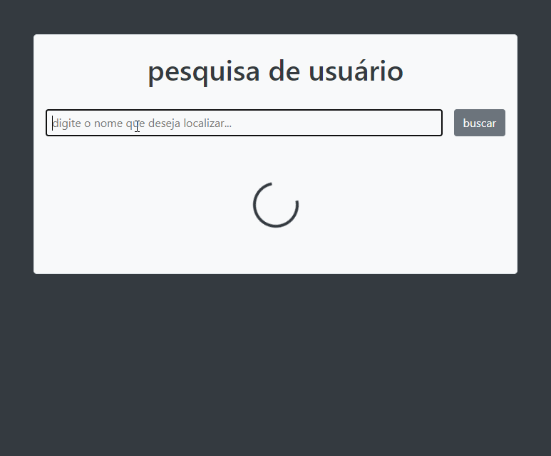

## 
<b>Localizador de Usuários</b>

  

### :muscle: Projeto

<b>Localizador de usuários</b> é um projeto que visa aplicar os conhecimentos em <b>JavaScript</b> para manipulação e visualização de dados através de uma API.
O projeto faz parte do <b>Bootcamp Desenvolvedor Full Stack</b> ministrado pelo IGTI.

Os demais projetos relacionados ao Bootcamp podem ser encontrados no repositório:

- [igti-dev-fullstack](https://github.com/JoaoCampista/igti-dev-fullstack)

### :rocket: Tecnologias utilizadas

Este projeto foi desenvolvido com as seguintes tecnologias:

- [HTML5](https://html.spec.whatwg.org/multipage/)
- [CSS3](https://www.w3.org/TR/css3-roadmap/)
- [JavaScript](https://www.ecma-international.org/ecma-262/9.0/index.html)
- [Live Server](https://marketplace.visualstudio.com/items?itemName=ritwickdey.LiveServer)
- [Bootstrap](https://getbootstrap.com)
- [Random User API](https://randomuser.me)

### :recycle: Como contribuir

- Fork esse repositório;
- Crie uma branch com a sua feature: `git checkout -b my-feature`
- Commit suas mudanças: `git commit -m 'feat: My new feature'`
- Push a sua branch: `git push origin my-feature`

### :memo: Licença

Esse projeto está sob a licença MIT. Veja o arquivo [LICENSE](LICENSE) para mais detalhes.

---

Feito com ❤️ por <strong>João Campista :wave: 

